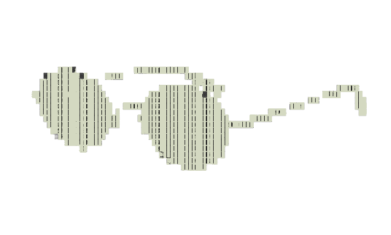

  

  &nbsp;&nbsp;
  &nbsp;&nbsp;
  &nbsp;&nbsp;
  &nbsp;&nbsp;
  &nbsp;&nbsp;
  

 

---

  <code>// recursos gratis</code>

  <h2>Aprende backend &nbsp;</h2>
  <h2></h2>

  
Todos los recursos son completamente gratuitos. Porque el conocimiento no debería tener paywall.

 

| 
**`Java · En construcción`**  **Java Prep — Entrevistas técnicas**  Repositorio con todo lo que necesitas para pasar una entrevista técnica de Java. Colecciones, concurrencia, JVM, patrones y más.  [Ver recurso →](https://github.com/Jorexdev/java-prep)
 | 
**`Kafka · En construcción`**  **Kafka para desarrolladores**  Mensajería distribuida explicada desde las bases, no importa si no conoces nada de código para esta introducción.  [Ver recurso →](https://youtube.com/@jorexdev)
 |
|---|---|

 

